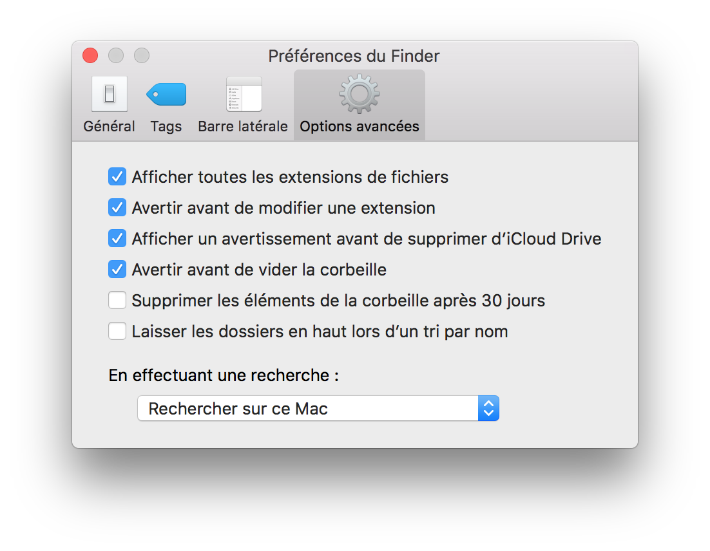
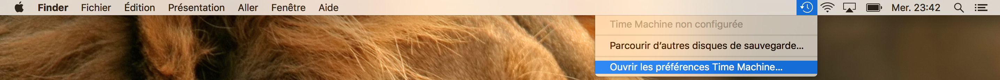
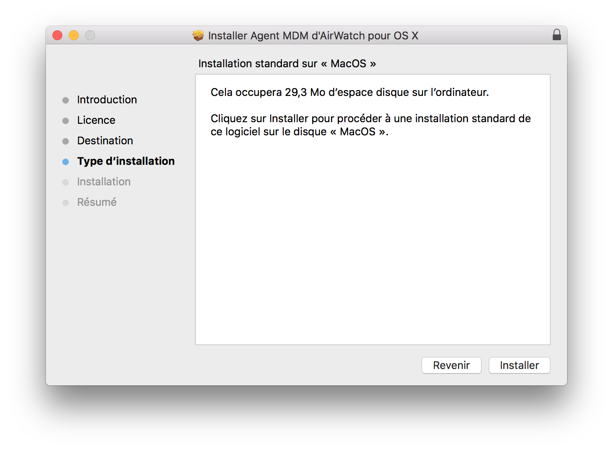

# Procédure d'installation d'un Mac Managé


## Install MacOs

TODO

### Reinstall latest MacOs (optionnal)

## Configuration de la Souris

TODO

## Configuration du Finder

Pour voir toutes les extensions de fichier, ouvrer les préférences dans la barre de menu `Finder > Préférence` et sélectionner dans l'onget `Options Avancées` la case `Afficher toutes les extensions de fichier`.



## Partition Disk

Lancer l'utilitaire de disque et créer une partition pour les sauvegardes Time Machine :


## Configuration TimeMachine




## FileVault

TODO

## AirWatch

Il faut tout d'abord vérifier auprès de votre support IT que vous faites partie du groupe ActiveDirectory 'CoreConnect'.

Télécharger l'agent sur : https://awagent.com

Installer AirWatch





## Enroller votre Mac

TODO

## Installation des XCode Command Line Tools

Les outils de ligne de commande XCode fournissent une longue liste d'outils utile pour le terminal, en particulier git et les compilateurs C, C++, Fortran, ...

	xcode-select --install


## Create SSH Keys

Taper la commande suivante dans un terminal en _**modifiant l'adresse email**_ :

	ssh-keygen -t rsa -b 4096 -C "your_email@example.com"

Ne pas mettre de "passphrase" et valider.

Lancer ensuite la commande :

	ssh-add ~/.ssh/id_rsa

## Installation de Brew

	ruby -e "$(curl -fsSL https://raw.githubusercontent.com/Homebrew/install/master/install)"
	brew update

## Installation de Chrome

	brew cask install google-chrome

## Installation de R et RStudio

	brew install Caskroom/cask/rstudio

## Install Python3

	brew install python3

## Install Postgresql

	brew install postgresql
	brew services start postgresql

## Install PostGIS

	brew install postgis

## Install VirtualBox

	brew cask install virtualbox

## Install Sublime Text 3

### Base package

	brew cask install sublime-text

### Configuration du 'user profil'

Il est plus agréable de travailler avec une configuration spécialement conçue pour les développeurs. Pour cela aller dans le menu `Sublime Text > Preferences > Settings` et copier coller les paramètres suivants dans la partie droite de l'écran. Sauvegarder avec `cmd+S` et fermer la fenêtre.

```json
{
	"always_show_minimap_viewport": true,
	"bold_folder_labels": true,
	"ensure_newline_at_eof_on_save": true,
	"folder_exclude_patterns":
	[
		".svn",
		".git",
		".DS_Store",
		"__pycache__"
	],
	"highlight_line": true,
	"highlight_modified_tabs": true,
	"ignored_packages":
	[
		"Vintage"
	],
	"rulers":
	[
		79
	],
	"shift_tab_unindent": true,
	"show_line_endings": true,
	"trim_trailing_white_space_on_save": true,
	"wrap_width": 80
}
```

### Package Control

Suivre les instructions pour la version 3 sur cette [page](https://packagecontrol.io/installation#st3) afin d'installer le gestionnaire de package de Sublime Text 3.

### SideBarEnhancements

Dans sublime :

	cmd+shift+p
	Package Control : Install Package
	SideBarEnhancements

### Anaconda

Dans sublime :

	cmd+shift+p
	Package Control : Install Package
	Anaconda

### git

Dans sublime :

	cmd+shift+p
	Package Control : Install Package
	git

### gitgutter

Dans sublime :

	cmd+shift+p
	Package Control : Install Package
	gitgutter

### terminal

Dans sublime :

	cmd+shift+p
	Package Control : Install Package
	terminal

### Markdown Preview

Dans sublime :

	cmd+shift+p
	Package Control : Install Package
	Markdown Preview

## Installation de MS Office for Mac

TODO

### Configurer la boîte de réception Outlook

TODO

## Installation de OneDrive

TODO

## Installation de Lync

TODO
